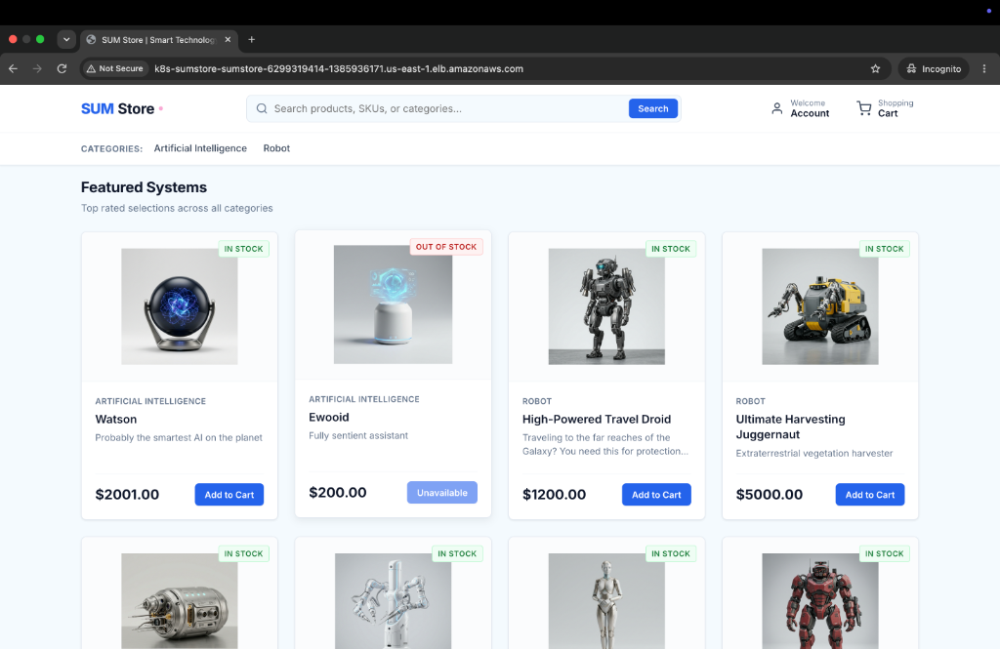

# SUM Store — Polyglot Cloud-Native E-Commerce Platform

A production-ready, polyglot microservices e-commerce platform engineered for high availability, fault tolerance, and seamless cloud deployments. 

The application delivers an end-to-end shopping experience—from product discovery and dynamic cart management to real-time shipping calculation, payment processing, and automated dispatch—all orchestrated cleanly across decoupled backend services and deployed on **Amazon EKS**.



---

## Architecture & Technology Stack

SUM Store was built from the ground up to showcase modern polyglot microservice design patterns. Each service runs in its own container, uses the best-fit database technology for its data access pattern, and communicates via fast REST APIs or asynchronous event queues.

```
                     +---------------------------------------+
                     |        AWS ALB / Ingress Router       |
                     +---------------------------------------+
                                         |
                                         v
                     +---------------------------------------+
                     |       Nginx & Storefront UI (web)     |
                     +---------------------------------------+
                                         |
         +-------------------------------+-------------------------------+
         |               |               |               |               |
         v               v               v               v               v
  +-------------+ +-------------+ +-------------+ +-------------+ +-------------+
  |  Catalogue  | |    Cart     | |    User     | |  Shipping   | |   Ratings   |
  |  (Node.js)  | |  (Node.js)  | |  (Node.js)  | |   (Java)    | |    (PHP)    |
  +-------------+ +-------------+ +-------------+ +-------------+ +-------------+
         |               |               |               |               |
         v               v               v               v               v
     [MongoDB]        [Redis]        [MongoDB]        [MySQL]        [MySQL]
                                         |
                                         +-------------------+
                                         |                   |
                                         v                   v
                                  +-------------+     +-------------+
                                  |   Payment   |     |  Dispatch   |
                                  |  (Python)   |     |  (Golang)   |
                                  +-------------+     +-------------+
                                         |                   |
                                         +--------->[RabbitMQ]
```

### Services Breakdown

| Service | Technology | Data Store / Messaging | Purpose |
| :--- | :--- | :--- | :--- |
| **`web`** | Nginx & AngularJS | — | Single-page storefront and reverse proxy routing API requests |
| **`catalogue`** | Node.js (Express) | MongoDB | Product catalog browsing, category filtering, and item detail lookups |
| **`cart`** | Node.js (Express) | Redis | Low-latency session state and shopping cart lifecycle |
| **`user`** | Node.js (Express) | MongoDB | Customer authentication, session tokens, and profile management |
| **`shipping`** | Java (Spring Boot) | MySQL | Shipping cost calculation, distance lookups, and order routing rules |
| **`payment`** | Python (Flask) | — | Payment authorization and checkout validation |
| **`dispatch`** | Go (Golang) | RabbitMQ | Asynchronous background order processing and fulfillment queuing |
| **`ratings`** | PHP | MySQL | Customer reviews and product ratings service |

---

## Production Deployment on AWS EKS

The production infrastructure is built on **Amazon Elastic Kubernetes Service (EKS)** following GitOps practices. Infrastructure manifests, Helm charts, and environment-specific values are maintained in the [Sumstore-GitOps](https://github.com/sumanthbcloud/Sumstore-GitOps) repository.

### Traffic Flow on Kubernetes:
1. **Edge Routing**: Incoming traffic enters through an AWS Application Load Balancer (ALB) managed by the AWS Load Balancer Controller.
2. **Reverse Proxying**: The ALB forwards traffic to the `web` deployment pods, where Nginx handles static frontend assets and cleanly rewrites `/api/*` endpoints to target cluster-internal service meshes.
3. **Resilience & Scaling**: Microservices scale horizontally (HPA) based on workload demand, with isolated database volumes, configuration management via ConfigMaps/Secrets, and strict health checks (`liveness` & `readiness` probes).

---

## Getting Started

### Prerequisites
- Docker & Docker Compose
- `curl` (for running automated smoke tests)

### 1. Run Locally with Docker Compose

You can launch the full multi-container stack locally in a single command:

```shell
docker-compose up -d
```

Once all containers report healthy, open your browser and navigate to:
**[http://localhost:8080](http://localhost:8080)**

To view real-time logs across services:
```shell
docker-compose logs -f
```

To stop the environment:
```shell
docker-compose down
```

---

### 2. Build Images from Source (Optional)

If you're modifying services or building custom images:

```shell
# Build all microservice images locally
docker-compose build

# Tag and push images to your container registry (configured in .env)
docker-compose push
```

---

## Observability & Metrics

Core business services expose native Prometheus metrics endpoints for real-time monitoring and alerting:

- **Cart Service (`/metrics`)**: Real-time counter of items added, modified, or removed.
- **Payment Service (`/metrics`)**: Counters for completed purchases, cart size distributions, and cart value histograms.

Verify endpoints locally or in your Kubernetes cluster:
```shell
curl http://localhost:8080/api/cart/metrics
curl http://localhost:8080/api/payment/metrics
```

---

## Automated End-to-End Smoke Test

A comprehensive test script validates the complete customer purchase lifecycle against any running environment (local, staging, or production EKS):

- Product discovery and catalogue query
- User registration and authentication
- Adding items to the cart
- Shipping fee computation
- Product review / rating submission
- Payment verification and order completion

Run the test suite against your endpoint:

```shell
BASE_URL=http://<your-host-or-alb-endpoint> ./scripts/e2e-smoke-test.sh
```

---

## Project Structure

```
├── app/                  # Polyglot backend microservices
│   ├── cart/             # Shopping cart service (Node.js)
│   ├── catalogue/        # Product catalog service (Node.js)
│   ├── dispatch/         # Order processing worker (Go)
│   ├── payment/          # Checkout and payment gateway (Python)
│   ├── ratings/          # Reviews & ratings service (PHP)
│   ├── shipping/         # Distance and rate calculator (Java Spring Boot)
│   └── user/             # User profiles and authentication (Node.js)
├── db/                   # Database init scripts & schemas (MongoDB, MySQL)
├── docs/                 # Documentation assets and screenshots
│   └── images/           # Architecture diagrams and UI captures
├── scripts/              # CI/CD and automated E2E testing scripts
├── web/                  # Web storefront and Nginx configuration
└── docker-compose.yaml   # Local multi-container orchestration definition
```
